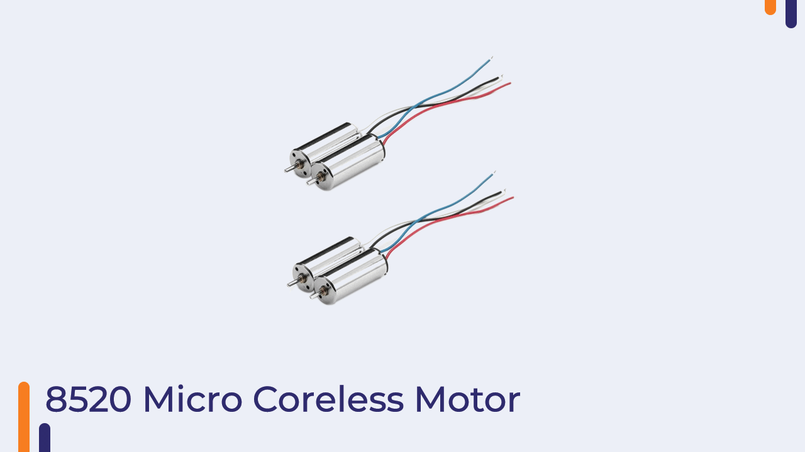
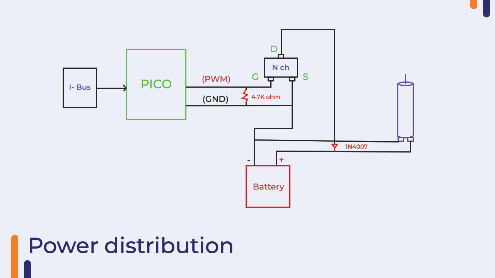

# DC Motor Control for Quadcopters

- Pros
    - DC motors are cheap
    - Motor controllers are easy to build or cheap to buy
    - Small allowing small quadcopters
- Cons
    - Should run for a while (100-1000 hrs) before the brush wears out
    - Run hot
    - Low thrust

