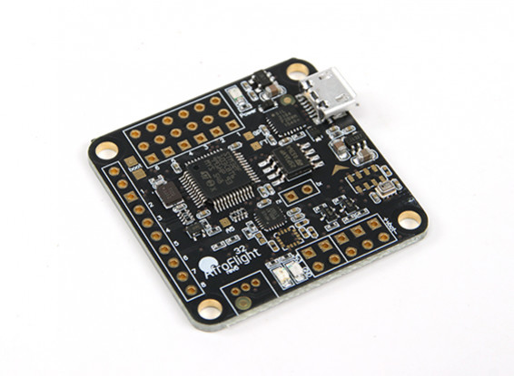
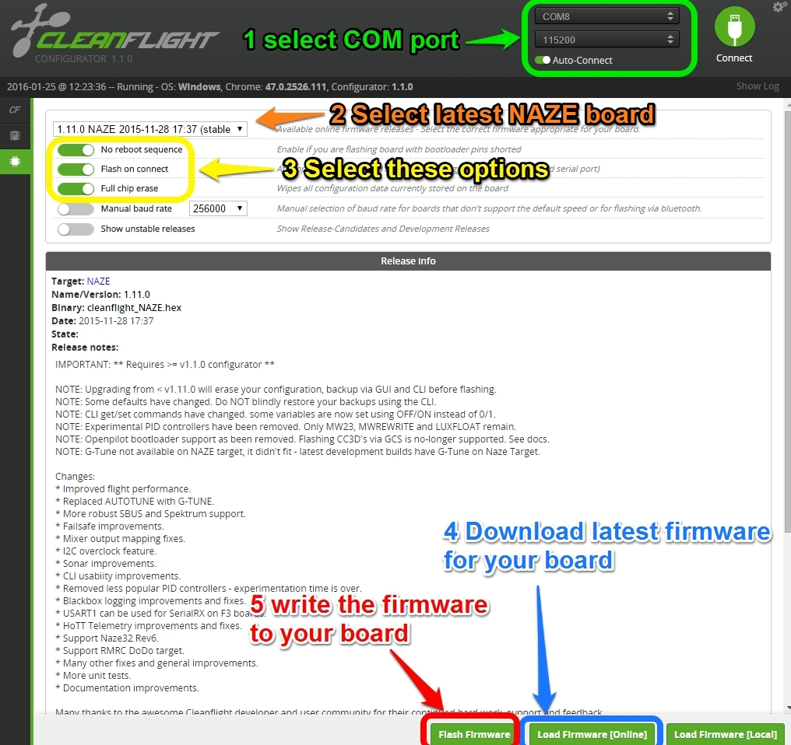

# Flight Controller

Designed for serious quad racers and freestyle maniacs, the AfroFlight Naze32 flight controller is undeniably the most used, recognised and supported flight controller in the scene today.

With a 32bit ST micro processor and a host of equally impressive sensors, this Rev6 Acro version comes with 16mbit memory and the BMP280 barometer.

This board also comes with angled header pins and is configurable with baseflight / Cleanflight via the onboard USB connector.

Features:
- USB on right side
- PPM/PWM input as through-hole
- Flexible motor outputs, support various airframe types:
Quad/Hexa/Tri/Bi/Y4/Y6/Octo/Camera Gimbal. (Default is Quad-X)
- Up to 8 ch RC input - supports standard receivers (PWM), PPM Sum receiver (FrSky, etc), or Spektrum satellite receivers.
- Built in FrSky telemetry inverter
- Battery voltage monitoring
- Modern 32-bit processor running at 3.3V/72MHz (STM32F103CB).
- 3.3V, I2C on standard-size headers
- SBUS Inverter built in
- Spectrum satellite
- MPU6500
- Sonar pads w/resistors added for direct connection to 5V sonar
- BMP280 barometer

Specs:
Dimensions: 36x36 mm (30.5mm Mounting)
Weight: 5.3 grams (no headers, 7.3 grams with)
Input voltage: Max 16V on input rail and up to 35V 6s on the voltage sense line

Includes:
Naze 32 Rev6 board
4 x sets of pins
1 x RC Breakout cable

## Flashing the Board

**WARNING:** I have an F1 board of the STM32 and no one supports
it anymore ... don't use!

**NOTE:** Ok, that said, if you use an older version of CleanFlight, it does work to an extent

- Install CleanFlight from the Google App Store
- I also used baudrate of 115200
- I flashed with CleanFlight 2.1 for the NAZE ... don't use the latest, it doesn't work
  - Doesn't support everything like GPS

# References

- [dronetest.com](https://www.dronetrest.com/t/naze-32-revision-6-flight-controller-guide/1605)
- [cleanflight.com](https://github.com/cleanflight/cleanflight)
- [oscarliang.com flight controller review](https://oscarliang.com/best-flight-controller-quad-hex-copter/)
- [AbuseMark Naze32](http://shipow.github.io/cleanflight-web/docs/board-naze32.html)
- [hobbyking.com buy](https://hobbyking.com/en_us/afroflight-naze32-rev6-flight-controller-acro.html)
