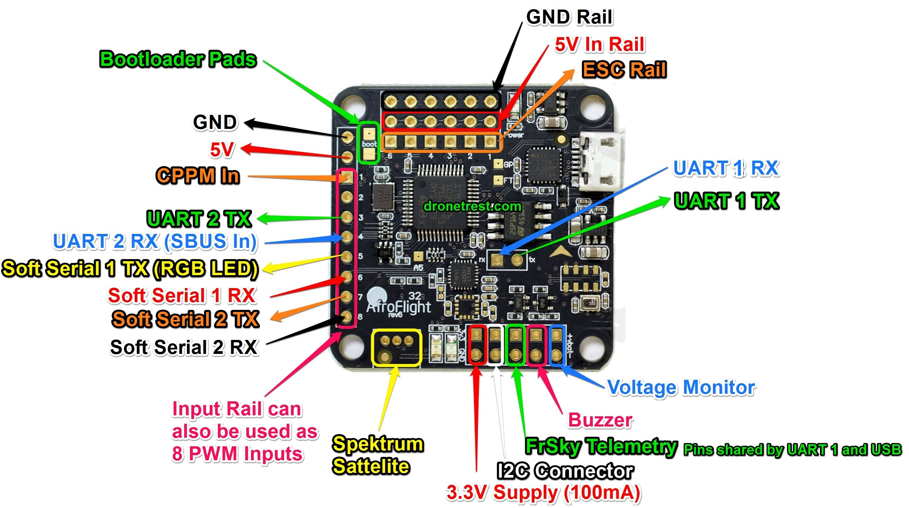
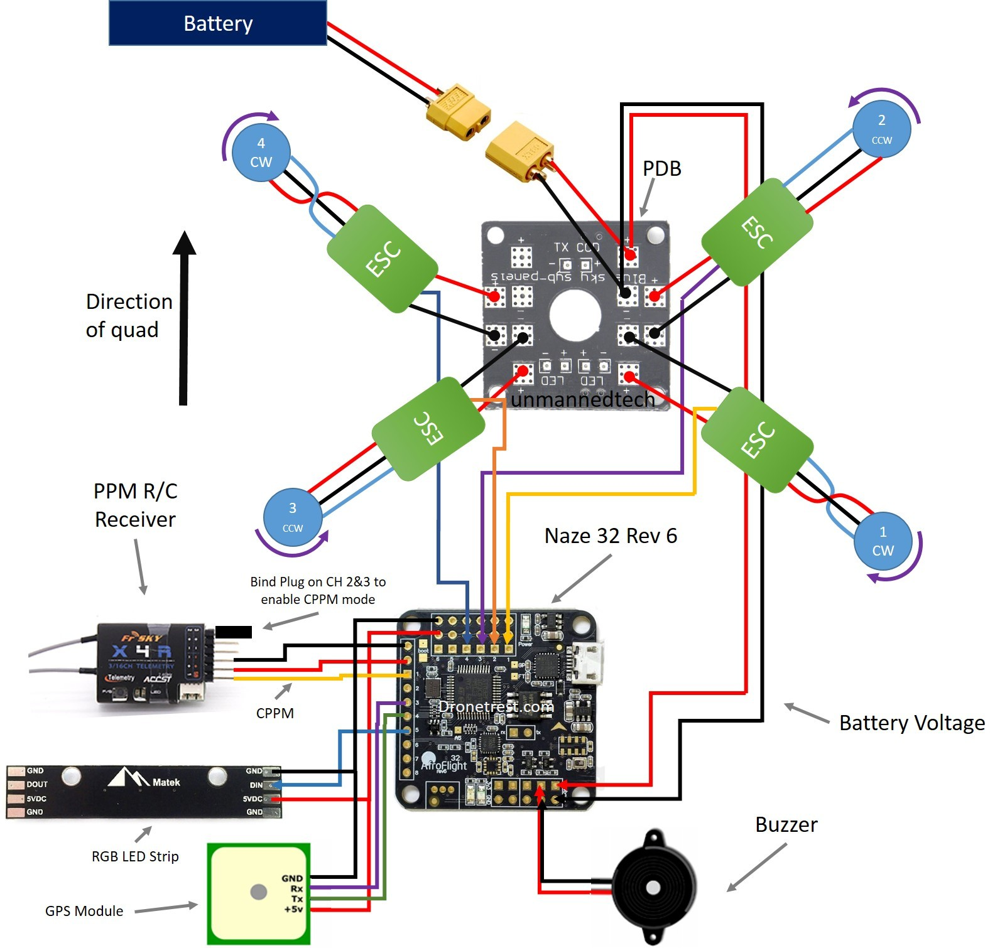

# Docs

I am using a Naze32 rev6 board from Afroflight ... it is old. You can use Cleanflight 
configurator, but use the older 2.4 version because this board *is not supported* by
most modern flight control configuration systems anymore.

- STM32 F1 32b processor
- MPu6500 invensese Accel/Gyro
- BMP280 Barometer
- 16 Mb onboard memory

## Issues

- Not enough memory for GPS support :P

## Pinouts

# References

- [Manual V1.2](Naze32_rev6_manual_v1.2.pdf)
- [Cleanflight docs](https://github.com/cleanflight/cleanflight/tree/master/docs)
